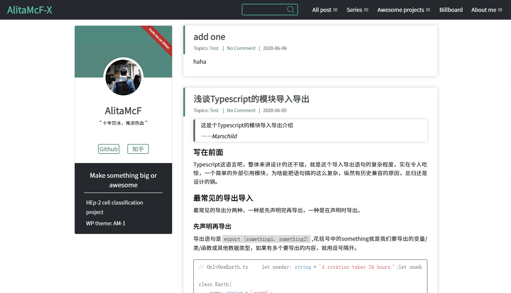
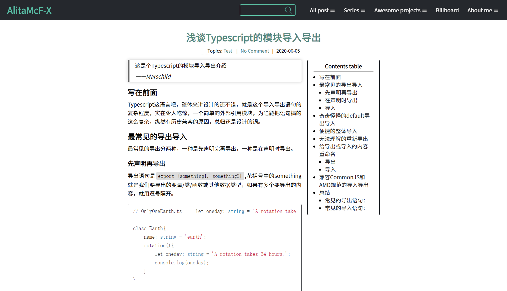

# AM-1
This's a personal WordPress theme. Demonstration website: [AlitaMcF' Blog](https://shaunfong.com)
###### Specific notation：I can't offer the security guarantee for this theme and don't responsible for any possible commercial loss. Please pay attention to the security before using this theme.

## Why I make the theme by self?
I like and I do.

## Some shortcomings about the theme
1. Couldn't customized through WP admin.
2. Withous responsive design.
3. Cause this is my first front-end project, I was lack of experience. A lot of codes are not standard enough, and this will cause many troubles for maintenance.

## What dose AM-1 look like?
### Home page:

### Single post page (top):

### Single post page (bottom):

## How to use it?
1. Clone this repository to your server. Using command:`git clone https://github.com/AlitaMcf/AM-1`or`git clone https://gitee.com/alitamcf/AM-1`
2. Then copy **AM-1** to the path: **YOUR WORDPRESS ROOT/wp-content/themes/**. 
3. Ater that, log in to your WP dashboard and change your current theme to **AM-1**.
4. Modify the theme code freely.

****

### Task Lists
- [x] **home.php** main UI.
- [x] **header.php**/Home page navigator.
- [x] add pull-down list to header navigator.
- [x] **sidebar.php** main code.
- [x] **single.php** main code.
- [x] **search.php** main code.
- [x] **404.php** main code.
- [x] **footer.php** main code.
- [x] add **GoTOP** button.
- [x] **page.php**
- [x] add contents table for single post
- [x] **archive.php**
- [x] **category.php**
- [ ] ~~响应式设计~~
- [ ] ~~管理页自定义外观~~

### Todo Lists
- [ ] design comment module.
- [ ] fix the bug of DISQUS module.
